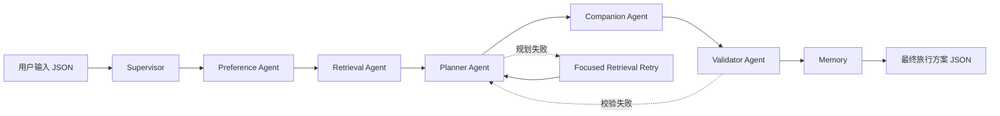
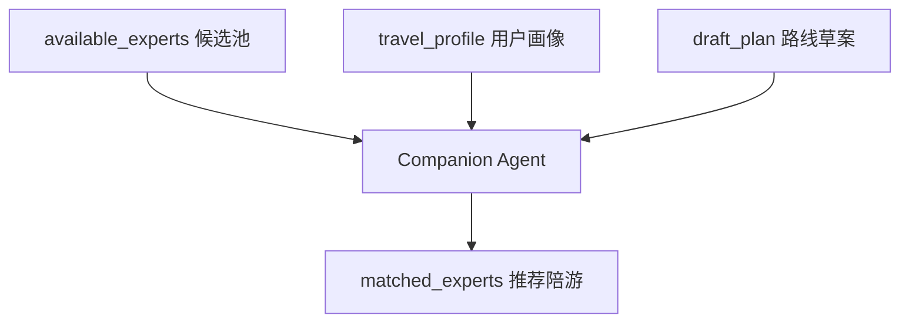

# 岛游智选：小青 Multi-Agent 智能旅行规划系统设计与实现

## 1. 项目背景

`岛游智选` 是一个围绕青岛本地深度旅行体验设计的应用 Demo。它希望帮助用户从“想去青岛玩”走到“拥有一条可执行、可修改、可解释的路线”，并在路线生成后进一步推荐适合的本地陪游达人。

小青是这个产品里的 AI 旅程规划师。早期 Demo 中，小青的路线结果主要由前端静态逻辑生成；当前版本已经被改造成一个本地可运行的 LangGraph Multi-Agent 原型，支持真实 POI 检索、路线规划、陪游匹配、校验回退、记忆保存和可视化演示。

当前小青的目标不是替代完整 OTA 或地图系统，而是作为一个从 0 到 1 的智能旅行规划 Agent 原型，证明以下能力：

- 能理解结构化旅行需求和自由备注。
- 能基于真实候选 POI 规划青岛路线。
- 能从真实候选陪游池中选择匹配达人。
- 能通过 Supervisor 编排多个 Agent 协作。
- 能在规划失败或校验失败时自动重试。
- 能输出前端可渲染的结构化旅行方案。
- 能通过可视化控制台展示 multi-agent 工作过程。

## 2. 小青的核心定位

小青不是闲聊机器人，而是一个面向青岛本地旅行决策的 Multi-Agent 工作流系统。

它接收用户的旅行表单和候选数据，经过多个 Agent 的协作，最终输出一份结构化旅行方案。它的主要职责包括：

- 理解用户旅行偏好、预算、节奏、同行关系和备注。
- 读取用户历史记忆，形成更稳定的旅行画像。
- 检索真实青岛 POI、起点、终点、餐饮候选和路线段。
- 基于真实候选生成多日行程。
- 从输入的陪游候选池中推荐合适达人。
- 校验路线是否满足天数、起点、终点等硬约束。
- 在规划失败时触发候选收缩与二次规划。
- 在校验失败时打回 Planner Agent 重新规划。
- 保存用户画像、路线和修改记录。

一句话概括：

> 小青是一个使用 LangGraph 构建的、可追踪、可回退、可扩展的青岛旅行规划 Multi-Agent 系统。

## 3. 为什么使用 Multi-Agent 架构

如果把所有能力都塞进一个单 Agent 或单 Prompt，很容易出现几个问题：

- 用户理解、地点检索、路线规划、陪游推荐和校验逻辑混在一起。
- 出错后很难判断是偏好理解错了、候选数据不够，还是模型规划错了。
- 模型容易编造不存在的地点或达人。
- 后续增加天气、交通、达人库、实时营业状态时，系统会变得难维护。
- 难以向别人展示“系统到底是如何推理和协作的”。

小青采用 Multi-Agent 架构，是为了让每个模块有明确边界：

- `Preference Agent` 专注理解用户。
- `Retrieval Agent` 专注认识真实世界。
- `Planner Agent` 专注路线生成。
- `Companion Agent` 专注陪游选择。
- `Validator Agent` 专注校验和格式化。
- `Supervisor` 专注调度、重试和分支控制。

这样做的价值是：

- 每个 Agent 职责清楚，容易测试和替换。
- 出错时可以局部重试，不必重跑整个系统。
- Agent 的执行链路可以通过 `agent_trace` 可视化。
- 后续接入新的工具或数据源时，可以新增 Agent，而不是重写主流程。

## 4. 技术框架：基于 LangGraph 的 Multi-Agent Workflow

小青不是把多个 Prompt 顺序调用，而是基于 LangGraph 把多个 Agent 建模为一张可分支、可回退、可观测的状态图。

### 4.1 为什么选择 LangGraph

小青需要处理的流程不是简单的：

```text
input -> prompt -> output
```

它需要：

- 缺少必填字段时提前结束并追问。
- Planner 失败后回到 Retrieval，收缩候选，再次规划。
- Validator 发现路线不合格后打回 Planner。
- Companion Agent 必须依赖 Planner 的路线草案做推荐。
- Memory 必须在最终结果生成后保存。
- 可视化控制台需要展示完整 `agent_trace` 和状态快照。

这些都是图结构比线性 Chain 更自然的场景。LangGraph 的 `StateGraph`、节点、边、条件边和子图能力，正好适合表达小青这种多步骤、多分支、多 Agent 协作流程。

### 4.2 LangGraph 核心概念在小青中的映射

| LangGraph 概念 | 小青中的实现 |
| --- | --- |
| `StateGraph` | Supervisor 主图和各 Agent 子图 |
| `TravelAgentState` | 多 Agent 共享状态 |
| Node | Agent 节点、工具节点、LLM 节点、校验节点 |
| Edge | 固定执行顺序 |
| Conditional Edge | 缺字段、Planner 失败、Validator 打回等分支 |
| Subgraph | Preference、Retrieval、Planner、Companion、Validator |
| `compile().invoke()` | 本地运行一次完整规划 |

核心代码文件：

```text
travel_agent/state.py
  定义 TravelAgentState

travel_agent/graph_builder.py
  定义 Supervisor 主图和 revise 子图

travel_agent/agents.py
  定义 Preference/Retrieval/Planner/Companion/Validator 子图

travel_agent/nodes.py
  定义每个 Agent 内部节点逻辑
```

### 4.3 Supervisor 主图

Supervisor 主图位于 `travel_agent/graph_builder.py`。

它负责注册各个 Agent 子图，并通过条件边控制流程：

```text
START
-> dispatch_preference
-> preference_agent
-> dispatch_retrieval
-> retrieval_agent
-> dispatch_planner
-> planner_agent
-> dispatch_companion
-> companion_agent
-> dispatch_validator
-> validator_agent
-> save_memory
-> END
```

主图并不是永远线性执行，它有三个关键分支：

```text
preference_agent 后：
  missing_info 存在 -> ask_clarification -> END
  missing_info 为空 -> dispatch_retrieval

planner_agent 后：
  planner_retry_requested=True -> retry_retrieval -> retrieval_agent
  否则 -> dispatch_companion

validator_agent 后：
  validator_replan_requested=True -> validator_replan -> dispatch_planner
  否则 -> save_memory
```

### 4.4 Agent 子图设计

每个 Agent 本身也是一个 LangGraph 子图，而不是普通孤立函数。

`Preference Agent`：

```text
START
-> trace_preference
-> normalize_form_input
-> load_memory
-> parse_note
-> merge_preferences
-> check_required_fields
-> END
```

`Retrieval Agent`：

```text
START
-> trace_retrieval
-> retrieve_poi 或 narrow_candidates_for_retry
-> rank_poi
-> match_experts
-> END
```

`Planner Agent`：

```text
START
-> trace_planner
-> plan_route
-> END
```

`Companion Agent`：

```text
START
-> trace_companion
-> select_companion_experts
-> END
```

`Validator Agent`：

```text
START
-> trace_validator
-> validate_plan
-> 如果需要重规划：END
-> 否则 format_json
-> END
```

这种设计使得每个 Agent 可以独立维护，也可以被 Supervisor 主图组合起来。

### 4.5 State 驱动，而不是开放式群聊

小青没有采用多个 Agent 互相自由聊天的群聊式架构，而是采用：

```text
Supervisor + Shared State + Worker Subgraphs
```

每个 Agent 都围绕同一个 `TravelAgentState` 工作：

- 读取自己需要的字段。
- 写入自己负责的输出。
- 不直接和其他 Agent 随意对话。
- 由 Supervisor 根据状态决定下一步。

这种方式更适合产品化，因为它：

- 可测试。
- 可追踪。
- 不容易失控。
- 输出结构稳定。
- 更容易接 API 和前端。

### 4.6 条件边与失败恢复

Planner 失败重试：

```python
graph.add_conditional_edges(
    "planner_agent",
    _route_after_planner,
    {
        "retry_retrieval": "retry_retrieval",
        "dispatch_companion": "dispatch_companion",
    },
)
```

当 `plan_route` 第一次失败时，它不会立即输出最终兜底路线，而是设置：

```text
planner_retry_requested=True
retry_count += 1
```

Supervisor 读取这个状态后，触发 `retry_retrieval`，让 Retrieval Agent 基于当前候选集进行收缩，再把更聚焦的候选交给 Planner Agent 二次规划。

Validator 打回重规划：

```python
graph.add_conditional_edges(
    "validator_agent",
    _route_after_validator,
    {
        "validator_replan": "validator_replan",
        "save_memory": "save_memory",
    },
)
```

当 Validator 发现天数、起点或终点不匹配时，它设置：

```text
validator_replan_requested=True
validation_retry_count += 1
```

Supervisor 会将流程打回 Planner Agent。重新规划成功后，流程会再次经过 Companion Agent 和 Validator Agent。

### 4.7 为什么不是简单 LangChain Chain

简单 Chain 更适合固定线性流程，而小青需要图结构：

- 缺字段时提前结束。
- Planner 失败后回到 Retrieval。
- Validator 失败后回到 Planner。
- Companion 推荐依赖路线草案。
- Memory 保存依赖最终结果。
- 可视化控制台需要完整 trace 和状态快照。

因此，小青使用 LangGraph 更自然，也更利于后续扩展。

## 5. 整体架构



当前主链路：

```text
Supervisor
-> Preference Agent
-> Retrieval Agent
-> Planner Agent
-> Companion Agent
-> Validator Agent
-> save_memory
```

其中：

- Preference Agent 输出 `travel_profile`。
- Retrieval Agent 输出 `live_candidates`。
- Planner Agent 输出 `draft_plan`。
- Companion Agent 输出 `matched_experts`。
- Validator Agent 输出 `validation_report` 和 `final_json`。
- Memory 保存用户画像、路线和修改记录。

## 6. Agent 分工说明

### 6.1 Supervisor

职责：

- 编排整个 LangGraph 主流程。
- 决定每一步调用哪个 Agent。
- 处理缺字段追问。
- 处理 Planner 失败后的候选收缩重试。
- 处理 Validator 打回重规划。
- 写入 `agent_trace`，用于可视化演示。

输入：

- 当前 `TravelAgentState`。

输出：

- 下一步执行路径。
- `agent_trace` 记录。

对应文件：

```text
travel_agent/graph_builder.py
```

### 6.2 Preference Agent

职责：

- 标准化前端表单。
- 读取用户历史记忆。
- 用 LLM 或本地规则解析备注。
- 合并兴趣、限制、特殊请求。
- 检查必填字段。

输入：

- `raw_form_input`
- `user_id`

输出：

- `normalized_input`
- `user_note`
- `note_semantics`
- `memory_context`
- `travel_profile`
- `missing_info`
- `companion_candidates`

对应节点：

```text
normalize_form_input
load_memory
parse_note
merge_preferences
check_required_fields
```

### 6.3 Retrieval Agent

职责：

- 调用真实在线工具检索青岛 POI。
- 检索起点和终点。
- 检索餐饮候选。
- 使用 OSRM 估算候选地点之间的路线段。
- Planner 失败后，对候选集进行收缩。

输入：

- `travel_profile`
- `live_candidates`
- `retry_count`

输出：

- `poi_candidates`
- `selected_restaurants`
- `live_candidates`
- `candidate_strategy`

对应工具：

```text
Nominatim: 地理检索
OSRM: 路线距离和耗时估算
```

对应文件：

```text
travel_agent/live_tools.py
travel_agent/nodes.py
```

### 6.4 Planner Agent

职责：

- 基于真实候选点生成多日路线草案。
- 调用 OpenAI 兼容 LLM 进行路线规划。
- 使用 Pydantic 校验 `DraftPlan`。
- 检查模型是否使用了候选外地点。
- 失败时通知 Supervisor 触发重试。

输入：

- `travel_profile`
- `live_candidates`

输出：

- `draft_plan`
- `planner_retry_requested`
- `retry_count`
- `json_error`

关键约束：

- 不允许编造 POI。
- 起点必须匹配用户输入。
- 终点必须匹配用户输入。
- 起点和终点不能被重复插入中途。

### 6.5 Companion Agent

职责：

- 从真实候选陪游池中选择匹配达人。
- 不在代码里硬编码达人。
- 不自行编造陪游。
- 按偏好、路线覆盖、可用日期、评分进行排序。

输入：

- `travel_profile`
- `draft_plan`
- `companion_candidates`

输出：

- `matched_experts`

推荐依据：

- 候选达人 specialties 是否匹配用户偏好。
- 候选达人 areas 是否覆盖路线中的 POI。
- 候选达人 availability_dates 是否覆盖出发日期。
- 候选达人 rating 是否更高。

陪游推荐流程：



### 6.6 Validator Agent

职责：

- 校验路线草案是否满足硬约束。
- 校验通过后格式化成最终前端可渲染 JSON。
- 校验失败时请求 Supervisor 打回 Planner。

输入：

- `travel_profile`
- `draft_plan`
- `matched_experts`

输出：

- `validation_report`
- `validator_replan_requested`
- `validation_retry_count`
- `final_json`

当前校验规则：

- `days_plan` 天数必须等于用户输入天数。
- 第一天第一站必须是起点。
- 最后一天最后一站必须是终点。

### 6.7 Memory

职责：

- 使用 SQLite 保存用户历史。
- 按 `user_id` 保存旅行画像、路线、修订指令和偏好统计。
- 给 Preference Agent 提供历史上下文。

默认数据库：

```text
.xiaoqing_memory.sqlite
```

对应文件：

```text
travel_agent/storage.py
```

## 7. 状态设计

小青的所有 Agent 通过 `TravelAgentState` 协同，而不是通过自由聊天传递信息。

关键字段：

| 字段 | 作用 |
| --- | --- |
| `raw_form_input` | 原始输入 JSON |
| `normalized_input` | 标准化后的表单 |
| `user_note` | 用户自由备注 |
| `note_semantics` | 备注解析结果 |
| `travel_profile` | 用户旅行画像 |
| `memory_context` | 历史记忆 |
| `live_candidates` | 真实 POI/餐厅/路线段候选 |
| `draft_plan` | 路线草案 |
| `companion_candidates` | 输入的陪游候选池 |
| `matched_experts` | Companion Agent 推荐结果 |
| `validation_report` | Validator 校验报告 |
| `final_json` | 最终前端可渲染 JSON |
| `agent_trace` | 多 Agent 执行轨迹 |
| `retry_count` | Planner 失败重试次数 |
| `validation_retry_count` | Validator 打回重规划次数 |

这种设计使得每个 Agent 都能被单独测试，也能在可视化控制台中展示每一步的状态快照。

## 8. 关键机制

### 8.1 真实候选约束

Retrieval Agent 先从真实在线地理服务中检索候选，然后 Planner Agent 只能基于这些候选生成路线。

这样可以减少 LLM 编造不存在地点的风险。

### 8.2 Planner 失败回退

```text
第一次 Planner 失败
-> Supervisor 触发 retry_retrieval
-> Retrieval Agent 收缩候选
-> Planner Agent 再规划
-> 仍失败才走规则 fallback
```

这个机制解决的问题是：候选点太多、模型输出不合规、路线顺序不合理时，系统可以先缩小问题空间，而不是直接失败。

### 8.3 Validator 打回重规划

```text
Planner 输出草案
-> Validator 发现天数/起点/终点不匹配
-> Supervisor 打回 Planner
-> Planner 重新规划
-> Companion Agent 重新匹配陪游
-> Validator 再校验
```

这让 Validator Agent 不只是“检查员”，而是有权推动系统修正错误。

### 8.4 陪游候选池选择

Companion Agent 不使用代码内置达人数据，而是只从输入中的：

```text
available_experts
companion_candidates
```

中选择。

这意味着未来接真实达人库时，只需要把达人库查询结果填进输入或上游状态，Companion Agent 的选择逻辑可以继续复用。

### 8.5 可观测 Trace

每次运行都会产生 `agent_trace`，例如：

```text
supervisor:dispatch_preference
preference_agent
supervisor:dispatch_retrieval
retrieval_agent
supervisor:dispatch_planner
planner_agent
supervisor:retry_retrieval
retrieval_agent
supervisor:dispatch_planner
planner_agent
supervisor:dispatch_companion
companion_agent
supervisor:dispatch_validator
validator_agent
```

这让小青的多 Agent 协作过程可以被展示、调试和讲解。

## 9. 输入输出协议

### 9.1 输入结构

```json
{
  "trip_time": {
    "departure_date": "2026/05/08",
    "duration_days": 2
  },
  "companions": {
    "relationship": "情侣/朋友",
    "people_count": 2
  },
  "budget_and_pace": {
    "budget_level": "舒适",
    "pace": "适中"
  },
  "route_points": {
    "start_location": "青岛站",
    "end_location": "五四广场"
  },
  "preferences": {
    "selected_tags": ["老城建筑", "本地海鲜", "避开排队", "摄影出片"],
    "note": "喜欢老城建筑、海景、海鲜，不想排太久队，希望有本地人推荐的小店。"
  },
  "available_experts": []
}
```

其中 `available_experts` 是未来真实达人库接口的返回结果。当前演示中通过输入 JSON 传入，Agent 不会自行编造陪游。

### 9.2 输出结构

```json
{
  "overview": {},
  "days_plan": [],
  "food_recommendations": [],
  "transport_summary": {},
  "risk_notes": [],
  "modifiable_options": [],
  "matched_experts": []
}
```

最终输出已经过 Pydantic `TravelPlan` 校验，适合前端直接渲染。

## 10. 可视化演示控制台

为了让作品展示更直观，小青提供了一个本地 Multi-Agent 控制台。

启动命令：

```powershell
cd "C:\Users\67423\Desktop\金山\青岛"
python -m travel_agent.cli debug-server --port 8765
```

访问地址：

```text
http://127.0.0.1:8765/debug
```

控制台包含三个区域：

- 左侧：输入 JSON，可以切换演示场景。
- 中间：Agent 执行链路和关键指标。
- 中间下方：状态快照，包括 `travel_profile`、`live_candidates`、`draft_plan`、`matched_experts`、`validation_report`。
- 右侧：最终路线和陪游推荐的产品化预览。

当前保留三个演示场景：

| 场景 | 展示重点 |
| --- | --- |
| 经典 2 日游 + 陪游推荐 | 完整规划链路、Planner 重试、陪游推荐 |
| 亲子轻松路线 | 节奏偏好变化、亲子陪游匹配 |
| 本地小店与夜市 | 餐饮/夜游偏好下的陪游排序差异 |

控制台相关文件：

```text
travel_agent/debug.py
travel_agent/debug_server.py
travel_agent/static/debug_console.html
```

## 11. 运行与验证

### 11.1 命令行生成路线

```powershell
python -m travel_agent.cli plan --user-id demo-user --input travel_agent/examples/qingdao_2day_with_companions.json --output travel_agent/tmp_plan_with_companions.json
```

### 11.2 修改已有路线

```powershell
python -m travel_agent.cli revise --user-id demo-user --current-plan travel_agent/tmp_plan.json --instruction "第二天轻松一点" --output travel_agent/tmp_revised_plan.json
```

### 11.3 启动可视化控制台

```powershell
python -m travel_agent.cli debug-server --port 8765
```

### 11.4 运行测试

```powershell
python -m pytest travel_agent/tests/test_xiaoqing_graph.py -q
```

当前测试覆盖：

- 主图生成前端可渲染路线。
- LangGraph 多 Agent trace。
- 真实候选检索和 LLM Planner 调用边界。
- Planner 失败后候选收缩重试。
- Validator 打回 Planner 重规划。
- Companion Agent 从真实候选池选择陪游。
- SQLite 记忆保存和读取。
- 可视化 debug payload。
- 多场景示例注册和读取。

## 12. 当前限制与下一步计划

### 12.1 当前限制

- POI 数据源当前使用 Nominatim，覆盖度和商业稳定性有限。
- 路线距离和耗时使用 OSRM，尚未接入国内地图实时交通。
- 餐厅和本地小店数据依赖 OSM/Nominatim 收录，可能为空或不完整。
- 陪游候选池当前由输入传入，还没有接真实达人库。
- Validator 当前只校验天数、起点和终点，还没有校验路线密度、午餐时间、绕路程度、亲子适配等。
- Revise 子图目前可用，但还没有完全拆成多 Agent 协作流程。

### 12.2 下一步计划

建议优先级如下：

1. 接入真实达人库，新增 `Expert Retrieval Agent`。
2. 接入高德或百度地图 POI，替换公共地理数据源。
3. 新增 `Weather Agent`，根据天气调整海边和室内备选。
4. 新增 `Transport Agent`，用真实交通耗时优化路线。
5. 增强 Validator，加入路线密度、绕路、预算、餐食时间等校验。
6. 将可视化控制台接入正式 Demo 页面。
7. 将 revise 子图升级为 `Revision Supervisor + Revision Planner + Revision Validator`。

## 13. 总结

小青当前已经从一个静态 Demo 中的路线生成逻辑，演进为一个可运行、可解释、可演示的 LangGraph Multi-Agent 旅行规划系统。

它的核心价值不只是“能生成一条路线”，而是：

- 有清晰的 Agent 分工。
- 有真实世界候选数据。
- 有结构化状态传递。
- 有失败重试和校验打回。
- 有陪游推荐协同。
- 有 SQLite 记忆。
- 有可视化控制台展示整个工作过程。

这让小青具备了继续扩展成真实产品 Agent 的基础。
