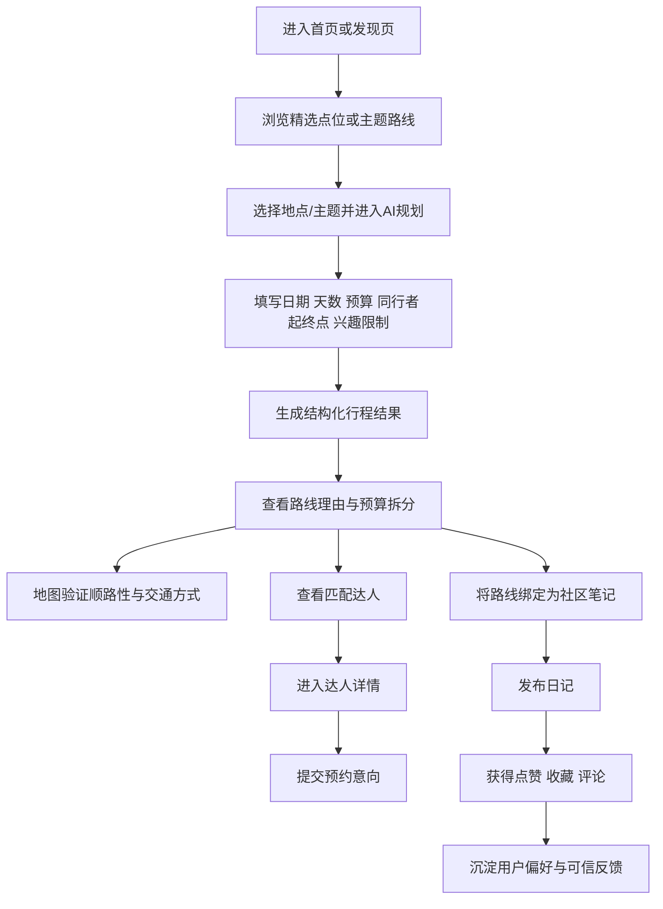

# 岛游智选产品方案

## 一、项目定位与用户问题

### 项目概览

| 项目     | 建议写法                                                        |
| ------ | ----------------------------------------------------------- |
| 产品名称   | 岛游智选                                                        |
| 产品定位   | 面向青岛单城深度旅行的 **AI 规划**与**本地陪游服务**平台                          |
| 目标用户   | 首次到访游客、情侣/朋友出游用户、美食爱好者、亲子/长辈同行用户、本地陪游达人                     |
| 核心痛点   | 信息分散、路线不顺、内容可信但不可执行、陪游服务没有集成、旅行反馈难沉淀、                       |
| 一句话方案  | 用 AI 把“发现内容—排顺路线—地图验证—选择达人承接—社区反馈”压缩为一条可执行的旅行决策链路，生成旅游行程规划。 |
| 当前交付形态 | Web HTML 高保真 Demo + App Demo + PRD 文档                       |

### 用户痛点

青岛旅行的本质问题不是“信息少”，而是“任务被不同工具以不同信息形态切碎了”。用户在同一段决策里，往往要同时处理地点灵感、路线合理性、消费口碑、订票预订和本地人服务，但这些能力通常分散在地图、攻略社区、点评平台、OTA 和私域联络里。

| 典型场景       | 用户当下任务       | 为什么会反复切换工具                              | 岛游智选对应解法                     |
| ---------- | ------------ | --------------------------------------- | ---------------------------- |
| 首次来青岛的两天游客 | 快速排出不折返的经典路线 | 攻略告诉你“去哪”，地图告诉你“怎么走”，但没人把顺路性和时间强度合成一份计划 | 用 AI 把景点、餐食、节奏、预算整合为可执行路线    |
| 情侣或朋友周末游   | 想轻松、出片、有氛围   | 种草内容很多，但拍照点、夜景、咖啡店、回程动线彼此割裂             | 用路线主题 + 达人匹配，把“好看”变成“顺路且能落地” |
| 海鲜/夜市类美食用户 | 想吃本地，不想踩雷    | 点评可看评分，社区可看体验，但加工费、排队、附近顺路玩法仍需自己拼       | 把本地吃法、避坑提示、附近路线与餐食安排绑定输出     |
| 亲子或长辈同行    | 想少走路、少排队、可替代 | 攻略往往只讲“值得去”，不讲体力强度、天气风险和休息点             | 在 AI 输出中加入节奏控制、风险提示和替代方案     |
| 临时想找陪游或陪拍  | 需要“靠谱的人”接住路线 | 现有平台里，人和路线通常是分开的，用户很难判断谁适合自己的计划         | 根据路线风格推荐达人，并直接发起预约意向         |

## 二、竞品参照与产品主线

### 竞品分析

| 竞品                                            | 公开强项                       | 主要短板                | 与岛游智选 的差异化启示                                 |
| --------------------------------------------- | -------------------------- | ------------------- | -------------------------------------------- |
| 马蜂窝                                           | AI 路书 + 当地指路人，最接近“规划到服务承接” | 多目的地平台，单城深度不一定足够    | **最值得正面对标**；本产品切口应更聚焦“青岛本地知识 + 深度景点研究+ 达人承接” |
| 圆周旅迹                                          | 抄作业、链接解析、路线生成、协作           | 偏工具，服务承接较弱          | 借鉴“低门槛导入攻略”的能力                               |
| Gooh旅记                                        | 行程组织、地图模式、解析、账单、行李清单       | 更偏旅行管理，不强调本地达人的线下履约 | 借鉴“结构化旅行管理”，但不要做重工具堆叠                        |
| 携程 / 飞猪 / 高德                                  | 供应链强、实时数据强、空间能力强           | 更偏平台化，全国性而非单城深做     | 不应和大平台拼广度，应拼“单城深度 + 本地服务”                    |
| 小红书 / 大众点评                                    | 分别占据内容灵感入口与决策验证入口          | 两者都不负责把整条路线编排完      | 岛游智选的价值在于把两类入口收束成一条链路                        |
| Withlocals / Airbnb / GetYourGuide / Mindtrip | 验证“本地人带玩”与“AI旅行助手”两种成熟方向   | 与中文单城本地服务、国内场景结合有限  | 可作为商业模式与体验设计参照，不必做形态复制                       |

目前最接近的竞品是”马蜂窝“。公开资料显示，马蜂窝的 AI 路书已经形成“主动提问—需求校准—精准生成”的路径，能基于真实内容数据输出包含行程、住宿、交通、预算和贴士的完整方案，并在结果页一键连接当地“指路人”服务。这与岛游智选的“AI 规划 + 达人承接”最为相似。

工具型参照更接近"圆周旅迹"。圆周旅迹强调从链接、图片和文字中解析攻略并自动提取地点，生成路线后再叠加地图导览、天气交通和多人协作；Gooh旅记则进一步覆盖按天编排行程、地点解析、地图模式、账单、行李清单和 Citywalk 轨迹，更像一款旅行组织工具。两者都强在“把分散攻略整理成可执行计划”，但都没有把“本地达人承接”做成核心闭环。

平台级竞争则来自携程、飞书和高德地图。携程 AI 行程助手已明确强调“一站式规划到预订”、权威数据验证和地图拖拽编辑；飞猪“问一问”采用多智能体架构，可调用机酒库存、景点玩法与本地生活服务数据，输出可交易的方案；高德地图 2025 则把地图升级为 AI 原生、具备空间智能和行动能力的出行助手。它们分别代表了 OTA 闭环、供应链实时性和地图空间能力的上限。

灵感与验证入口则分别是 小红书和大众点评。小红书的强项是兴趣社区、内容种草和“看别人怎么过一种生活”；大众点评的壁垒则在真实深度评论、评分体系以及门店营业状态、地址、营业时间、菜单价格等“基础事实库”。这正解释了为什么旅行用户在现有体验中必须同时使用内容平台和决策工具。

服务模式上，可参考 Withlocals、Airbnb 的 Experiences、GetYourGuide，以及 AI 旅行规划方向上的 Mindtrip。Withlocals 强调由本地人提供私人的 guided tour；Airbnb Experiences 明确提出“和最了解这座城市的本地人一起探索城市”，并有质量审核与 App 内行程整合；GetYourGuide 强在全球化活动与门票供给；Mindtrip 则代表了“个性化推荐 + 地图 + 协作 + 内容导入”的 AI 旅行规划形态。

综上竞品分析，本产品设计主链路为：**AI 路线规划 → 陪游达人预约（可选） → 社区反馈及攻略分享。**

| 主链路环节   | 页面承接         | 关键交互                     | 对用户的价值                         |
| ------- | ------------ | ------------------------ | ------------------------------ |
| 发现与选点   | 首页 / 发现页     | 搜索、筛选、点位详情、加入路线、收藏       | 快速形成“想去什么景点”的初始集合              |
| AI 路线规划 | AI 规划页       | 日期、天数、预算、同行者、起终点、兴趣与限制输入 | 把碎片信息压缩成结构化方案，结合大数据为用户提供最优游玩方案 |
| 地图验证    | Web 地图页      | 路线查询、出行方式切换、图层开关、时间距离展示  | 让用户直观判断路线是否真的顺路、是否可执行          |
| 达人承接    | 达人详情页 / 预约表单 | 匹配达人、查看服务、填写预约意向         | 把路线从内容建议推进到线下服务，供需要陪游的用户进行达人选择 |
| 社区反馈    | 社区页 / 发布页    | 浏览笔记、评论、点赞、收藏、发布绑定路线的日记  | 形成真实反馈，反哺后续路线与信任建设             |

## 三、旅程规划agent小青

**见旅行规划 Agent小青 实现方案（markdown文件）**

## 四、核心页面展示

详情交互和功能见demo，os:如果是给研发的PRD这里肯定会详细展开写，作为面试作品作品这里先不展开

## 五、闭环设计与实施路线

### 交互闭环

### 数据埋点

| 步骤          | 前置条件           | 成功指标建议             |
| :---------- | :------------- | :----------------- |
| 进入首页/发现页    | 首屏加载成功，入口清晰    | 首页到 AI 规划或点位详情 CTR |
| 浏览精选点位/主题路线 | 至少有一组点位或路线模板可看 | 点位详情打开率、加入路线率      |
| 填写 AI 偏好    | 表单字段完整且易懂      | 表单完成率、放弃率          |
| 生成行程        | 规则或模型返回成功      | 生成成功率、平均生成耗时       |
| 查看路线理由与预算   | 结果页结构清晰        | 结果停留时长、保存率         |
| 地图验证        | 路线可被查询或可视化     | 地图查看率、路线查询成功率      |
| 查看达人并预约     | 有匹配逻辑与预约表单     | 达人详情点击率、预约意向提交率    |
| 绑定路线发布日记    | 已有生成路线摘要       | 社区发布率、笔记互动率        |

### MVP与迭代路线

 

| 版本阶段                | 版本定位                           | 核心功能                                         | Agent 能力                                                | 验证目标                             |
| :------------------ | :----------------------------- | :------------------------------------------- | :------------------------------------------------------ | :------------------------------- |
| MVP 1.0：Agent 规划可用版 | 最小可上线版本，验证用户是否愿意使用 AI 做青岛旅行规划  | 用户登录、旅行需求输入、AI 路线生成、路线详情页、路线保存、基础达人推荐        | 训练好的青岛本地旅行 Agent，能够理解天数、预算、同行人、兴趣偏好、出发点、节奏要求，并生成结构化行程   | 验证 AI 生成路线是否可用，用户是否愿意保存路线或继续查看达人 |
| V1.1：路线可信增强版        | 提升 AI 结果可信度，减少“看起来合理但实际不可用”的问题 | POI 地点库、营业时间校验、地图距离校验、路线顺路性判断、预算估算、风险提示、备选方案 | Agent 接入本地知识库、地图工具和规则校验，能解释为什么这样排路线，并提示不确定信息            | 验证路线是否真实可执行，降低 AI 幻觉和错误推荐        |
| V1.5：达人服务闭环版        | 从“给路线”升级到“有人接住路线”              | 达人详情页、达人标签、档期查询、预约意向单、客服确认、服务评价              | Agent 根据路线类型匹配达人，例如摄影、Citywalk、美食、亲子、夜游等，并说明匹配理由        | 验证用户是否愿意从 AI 路线进一步转化为达人预约        |
| V2.0：订单与履约版         | 建立商业闭环                         | 订单系统、支付、退款规则、达人接单、服务状态追踪、评价体系、投诉与风控          | Agent 在用户预约前进行服务说明、行程确认、注意事项提醒，并在订单后辅助生成出行清单            | 验证真实交易转化率、达人履约稳定性和用户满意度          |
| V2.5：社区反馈增长版        | 用真实用户反馈反哺路线和 Agent             | 游记发布、路线绑定、点赞收藏评论、避坑内容、达人服务反馈、热门路线榜单          | Agent 能从社区内容中提取高频反馈，例如排队、踩雷、拍照点、路线耗时，持续优化推荐策略           | 验证内容是否能沉淀为产品资产，而不是一次性工具          |
| V3.0：个性化推荐版         | 从单次规划变成长期旅行助手                  | 用户画像、历史路线、收藏偏好、预算偏好、同行人偏好、节假日专题推荐            | Agent 根据用户历史行为生成更个性化的路线，例如轻松型、拍照型、美食型、亲子型、本地深度型         | 提升复用率、留存率和推荐点击率                  |
| V4.0：多城市复制版         | 从青岛单城复制到其他城市                   | 城市知识库模板、达人入驻后台、城市运营后台、多城市路线库、城市切换            | Agent 架构从“青岛专属”升级为“城市插件式 Agent”，每个城市接入独立 POI、达人、路线和社区数据 | 验证单城模型是否可复制，降低新城市冷启动成本           |

